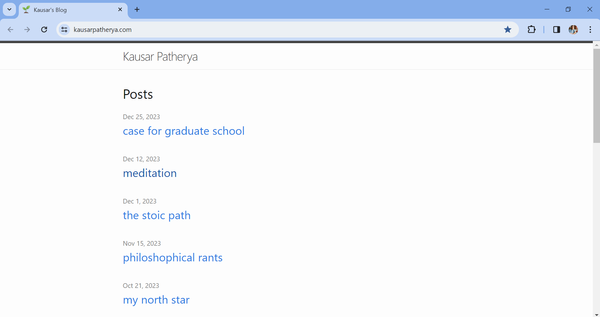

# Creating a Personal Blog using Jekyll

This repository contains the code used to set up my personal blog using Jekyll. Click [here](https://kausarpatherya.com/) to view my blog!

## Why Jekyll?

I've been meaning to create my own blog for quite a while, but I didn't get around to doing it. One of the primary reasons was my inability to converge on a respectable user interface. That, and the inertia one generally faces while attempting to write anything.

Jekyll made things easier. I came across [this](https://karpathy.github.io/2014/07/01/switching-to-jekyll/) article by Andrej Karpathy in January 2024 and decided to give it a shot. I didn't catch the Wordpress train, so this represented a fresh learning curve for me.

## Retospective

I found the whole process quite intuitive. Once you've set up Jekyll on your local computer, you best friends will be the 'config.yml', and '_posts' folder. Simply fill in the key attributes within the configuration file, and c/p your articles within the '_posts' folder. And voilà! Your website is ready.

Here's what the frontend looks like:

Using Jekyll reminded me how Terraform works. With a few commands made in your local shell, you can spin up a new version of your website, test its functionality, and eventually go live. It's the perfect training ground for aspiring web designers.

I followed the minima template. The UI doesn't make you go "wow!!" and that's not even the intention. I wanted this blog to be easy to read and easy to maintain. Writing is the activity that I want to optimize for, not design. Simpler UI = fewer distractions for the reader.

## Tidbits

I had taken part in the AWS resume challenge in January 2023, and built a visit counter on my website as part of the project (more can be found [here](https://github.com/kpath1999/resume-frontend)). I wasn't able to find a way to directly include my count API within the 'yml' file. I ended up digging through the '_site' folder (which you're not supposed to touch, since it resets everytime you run 'jekyll clean'). I manually added 'Visit count: ' to the 'index.html' file to get it to show up on the bottom of the main page.

Another piece I wish I knew was how to add the favicon icon (in my case, a seedling) to my blog tab. I ended up having to go through several 'html' pages and manually included the icon.

Finding ways to automate key steps of the development process will save me a lot of effort in the future. I will find ways of making these changes directly through the 'config.yml' file. Better to work smarter in this case since I foresee adding more of writing to the blog in the future.

## Summary

Despite the occassional tedium involved with creating this blog, I thoroughly enjoyed the entire learning process. I would highly recommend going through the Jekyll documentation - including a link [here](https://jekyllrb.com/docs/themes/). It will take you through the whole set-up process. I followed it to the tee and it worked just fine.

I myself will revisit this documentation to make use of new Jekyll features as the need arises. Thank you for reading this far. Good luck to you!